# Analog Tape-out Workflow

> A practical, process-independent notebook for taking an analog IC from **specification → schematic → layout → PEX → tape-out → measurement**.

This repository turns two real CMOS tape-out experiences into a reusable engineering workflow. It focuses on **how to think, verify, debug, and review** each stage without publishing proprietary foundry data.

`Analog IC` · `Tape-out` · `DRC / LVS / PEX` · `Post-layout · `Measurement`

---

## End-to-end flow

```mermaid
flowchart LR
    A[Specification] --> B[Architecture]
    B --> C[Schematic]
    C --> D[Pre-layout Verification]
    D --> E[PVT / Monte Carlo]
    E --> F[Layout]
    F --> G[DRC]
    G --> H[LVS]
    H --> I[PEX]
    I --> J[Post-layout Verification]
    J --> K[Full-chip Review]
    K --> L[Tape-out]
    L --> M[Packaging]
    M --> N[PCB / Bring-up]
    N --> O[Measurement]
```



The key idea is simple:

> **Tape-out is not the end of design. It is the point where design assumptions meet silicon, packaging, PCB parasitics and measurement reality.**

---

## Two real tape-out case studies

| Period | Project | Scope |
|---|---|---|
| **2024–2025** | **Two-Stage Operational Amplifier Engineering Tape-out & Test Verification** | First complete CMOS tape-out flow: transistor-level design, pre/post-layout verification, layout, physical verification, submission and test-oriented work |
| **2025–2026** | **0.18 μm LDO Linear Regulator Tape-out** | **Project Manager** ·- 3.3 V → 1.8 V · reference · error amplifier · comparator · power MOS · design/simulation/layout verification · tape-out and measurement-oriented evaluation |

→ [Two-stage op-amp case study](case-studies/01-two-stage-opamp.md)  
→ [0.18 μm LDO case study](case-studies/02-ldo-018um.md)

Official program coverage is listed in [SOURCES.md](SOURCES.md).

---

## Guide map

| Stage | Guide |
|---|---|
| 00 | [Workflow overview](docs/00-overview.md) |
| 01 | [Specification & test plan](docs/01-specification-and-test-plan.md) |
| 02 | [Schematic & pre-layout verification](docs/02-schematic-and-prelayout.md) |
| 03 | [PVT & Monte Carlo](docs/03-pvt-and-monte-carlo.md) |
| 04 | [Layout planning](docs/04-layout-planning.md) |
| 05 | [DRC](docs/05-drc.md) |
| 06 | [LVS](docs/06-lvs.md) |
| 07 | [PEX](docs/07-pex.md) |
| 08 | [Post-layout simulation](docs/08-postlayout-simulation.md) |
| 09 | [Config views & hierarchy](docs/09-config-view-and-hierarchy.md) |
| 10 | [Full-chip & tape-out review](docs/10-fullchip-tapeout-review.md) |
| 11 | [Packaging, PCB & measurement](docs/11-packaging-pcb-measurement.md) |
| 12 | [Debugging playbook](docs/12-debugging-playbook.md) |

---

## Five engineering lessons that matter

### 1. PEX changes the circuit, not just the schematic view
Parasitic resistance and capacitance alter poles, settling, edge rates, delay, startup and sometimes the apparent stability margin. Treat extracted simulation as a new physical model of the implementation.

### 2. A `config` is a hierarchy decision
The important question is not “did I add `calibre` somewhere?” but **which view is actually netlisted for every relevant cell**. A hierarchy can legitimately mix schematic and extracted views.

### 3. Sub-block LVS needs a valid interface
A block cannot be compared reliably when the layout and schematic expose different pins or hierarchy assumptions. Either make the block interface LVS-complete, use an appropriate wrapper, or validate it at the intended higher hierarchy.

### 4. Post-layout simulation is slower for a reason
PEX can add thousands of RC elements and internal nodes. The simulator solves a larger system and may need smaller timesteps around switching edges.

### 5. Signoff is a checklist, not a screenshot
A clean DRC or one passing transient is not “tape-out ready.” Signoff is the accumulated evidence that the design, hierarchy, views, corners, physical verification, top-level connectivity and measurement plan are internally consistent.

---

## Practical checklists

- [Pre-tapeout checklist](checklists/pre-tapeout.md)
- [Post-layout review checklist](checklists/post-layout-review.md)
- [Measurement bring-up checklist](checklists/measurement-bringup.md)

---

## Public-release guard

This repository includes a small checker to reduce the chance of accidentally committing foundry or private project artifacts.

```bash
python tools/verify_public_repo.py .
```

It rejects suspicious paths/extensions such as GDS/OASIS, extracted netlists, model files, PDK folders and rule-deck-like files, and also checks relative Markdown links.

> This is a convenience guard, **not a substitute for your NDA, foundry agreement, university policy, or manual review**.

---

## What is intentionally not included

- foundry PDKs or model cards;
- Calibre / physical-verification rule decks;
- process techfiles or layer maps;
- proprietary standard cells or device libraries;
- GDS/OASIS submission data;
- production extracted netlists;
- private server, license or infrastructure details;
- unredacted screenshots that expose restricted process information.

Exact design rules and signoff requirements are process-specific. Use authorized foundry documentation for any real tape-out.

---

## Repository philosophy

**Design with intent. Verify with evidence. Tape out with discipline. Measure with skepticism.**
