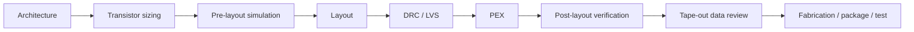

# Case Study 01 · Two-Stage Operational Amplifier Tape-out

**Period:** 2024–2025  
**Type:** First complete CMOS tape-out experience  
**Public program source:** [Glasgow College report](https://www.gla.uestc.edu.cn/info/1003/17178.htm)

## Engineering scope

The project was centered on a two-stage operational amplifier and used the full implementation loop:

## Reusable lessons

### Pre-layout results are only the first baseline
Gain, phase margin, swing, slew and bias behavior need enough margin to survive layout parasitics and process variation.

### Physical verification is part of design
DRC and LVS are not clerical final steps. Layout choices determine whether the circuit can be verified, extracted and later debugged.

### Measurement changes the mindset
Once a design must be tested on hardware, pin naming, package mapping, PCB access and instrumentation become design constraints rather than afterthoughts.

## Safe public artifacts

Good candidates include original block diagrams, generic two-stage op-amp theory, self-generated plots without restricted model metadata, and lessons learned.

Avoid foundry rule decks, PDK files, GDS/OASIS and full production netlists.
