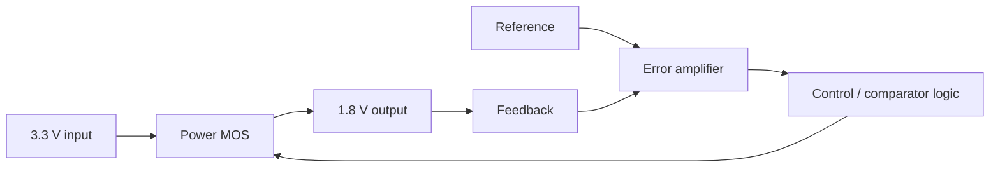

# Case Study 02 · 0.18 μm LDO Linear Regulator Tape-out

**Period:** 2025–2026  
**Role:** **Project Manager**  
**Function:** 3.3 V → 1.8 V linear regulation  
**Public program source:** [UESTC News report](https://news.uestc.edu.cn/info/1004/41344.htm)

The official program report describes the advanced LDO project as including a **reference block, error amplifier, comparator and power MOS stage**, with returning students completing circuit design, simulation verification and layout verification.

## Architecture view

The diagram is intentionally conceptual rather than a reproduction of the fabricated schematic.

## Project-manager responsibilities worth documenting

A project manager in a small analog tape-out team has to keep several interfaces aligned: block ownership, top-level pin/interface consistency, simulation assumptions, layout integration, verification status, tape-out data readiness and package/test preparation.

The main engineering value is not simply “managing people.” It is maintaining **consistency across abstraction levels**.

## Verification themes

- reference/bias startup;
- error-amplifier operating range;
- feedback correctness;
- line/load regulation;
- transient response;
- loop stability;
- PSRR;
- PVT robustness;
- post-layout correlation;
- measurement plan.

## Public-release lesson

A fabricated design can be discussed meaningfully without publishing the actual PDK or complete production layout. Architecture, verification methodology, failure analysis and sanitized measured/simulated results are usually more useful to readers.
