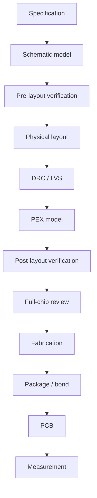

# 00 · Workflow Overview

An analog tape-out flow is a chain of models that become progressively closer to physical silicon:

Every transition introduces new failure mechanisms.

| Transition | New risks introduced |
|---|---|
| Specification → schematic | architecture error, bias margin, stability, headroom |
| Schematic → layout | matching, routing resistance, coupling, IR drop, pin mistakes |
| Layout → extracted | parasitic poles/zeros, delay, RC loading, coupling |
| Die → package | bond-wire inductance/resistance, pad parasitics |
| Package → PCB | supply impedance, probing, grounding, load realism |
| Simulation → measurement | model error, instrument limits, assembly defects |

The workflow is therefore not a sequence of software buttons. It is a sequence of **assumption checks**.

## Evidence hierarchy

A strong tape-out review should be able to answer:

1. What requirement is being verified?
2. Which model/view is used?
3. Which conditions/corners are included?
4. What is the measured metric?
5. What margin remains?
6. What changed relative to the previous abstraction level?
